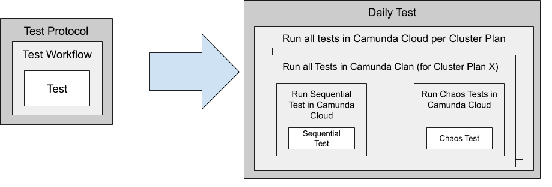
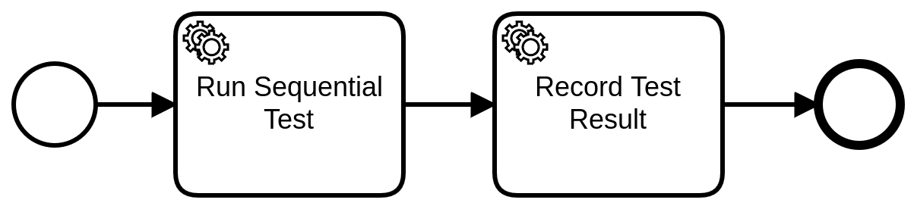
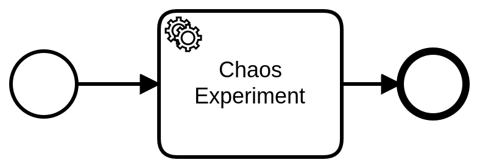
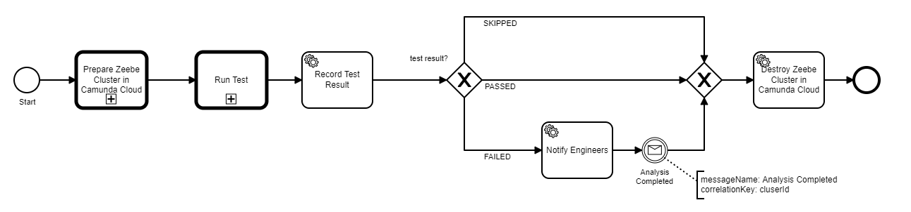
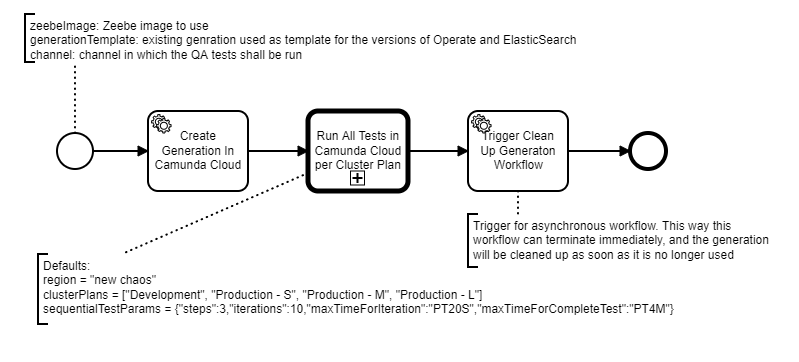
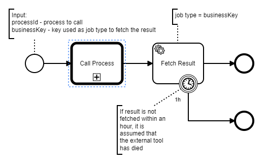
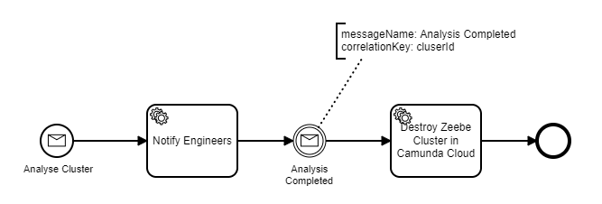
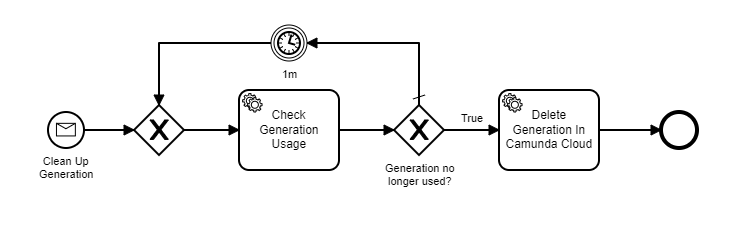

# Zeebe Cluster Testbench

Test bench to run tests against a Zeebe cluster.

Available Documentation

- [Developer handbook](docs/developer-handbook.md)
- [Operator handbook](docs/operator-handbook.md)
- [Technical documentation](docs/technical-documentation.md)
- [Service Task Reference](docs/service-tasks.md)

## User Guide

This document describes the different workflows that are deployed as part of this project. These workflows can either be launched directly - for ad hoc test runs - or they are launched by Zeebe as part of one of the periodic test protocols (e.g _Daily Test_).

This document also contains a list of the available workers. Users are encouraged to use these workers and define and deploy additional workflows based on these building blocks.

### Onion Principle

This document will be easier to understand by learning first about the "onion principle":

This document (and this project) define workflows at different levels of detail:

- Test - this is the smallest level of detail. A test workflow performs a given test routine. It assumes that the test environment is already set up for the test, and will be cleaned up afterwards. Thus, it can focus entirely on executing a particular test
- Test Workflow - this is the next level of detail. This layer is responsible for:
  - Spawning different variations for a test, if needed (e.g. run a test in different cluster plans; run the same test with different parameters)
  - Preparing the test environment for the test
  - Calling the test workflow
  - Recording test results, sending out notifications in case of test failures
  - Cleaning up the test environment after the test
- Test Protocol - this is the outermost layer. This is comparable to a test suite. Some protocols (e.g. _Daily test_) also include the schedule for running tests.

The purpose of the layering is to have reusable building blocks and separation of concerns between layers.

The different layers work well together, but can also be called directly. E.g. instead of having the testbench generate a cluster, a user could create a cluster by hand and then call a given test with the needed authentication details for that cluster.

### Tests

#### Sequential Test

In the sequential test a sequential workflow is executed several times in succession. There is at most one active workflow instance at any given time. In other words, there is no parallelism - neither inside the workflow being tested nor in the test driver that starts workflow instances.

A sequential test has the following parameters:

- _steps_ - number of steps within the workflow
- _iterations_ - number of times the workflow shall be executed
- _maxTimeForIteration_ - the maximum duration for one iteration
- _maxTimeForCompleteTest_ - the maximum time for the entire test

This test will fail, if any of the following conditions occur:

- there is an exception during test execution
- a single iteration takes longer than _maxTimeForIteration_
- all iterations take longer than _maxTimeForCompleteTest_

In case of backpressure the iteration will be repeated. The time spent making requests that return backpressure responses and repeating those requests is included in the overall execution time, which must be smaller than _maxTimeForCompleteTest_ for the test to pass.

##### Sequential Test Workflow

This workflow runs the sequential test in a given cluster in Camunda Cloud:

**Workflow ID:** `sequential-test`

| Inputs                  | Description                                     | Type                               |
| ----------------------- | ----------------------------------------------- | ---------------------------------- |
| `testParams`            | Settings to parameterize the sequential test    | `SequentialTestParameters`         |
| `authenticationDetails` | Credentials to authenticate against the cluster | `CamundaCloudAutenticationDetails` |

| Outputs      | Description | Type         |
| ------------ | ----------- | ------------ |
| `testReport` | test report | `TestReport` |
| `testResult` | test result | `TestResult` |

#### Chaos Test

This test runs a repertoire of [chaos experiments](https://github.com/zeebe-io/zeebe-chaos) against a given cluster. Different experiments run in sequence.

The set of experiemnts to run depends on the cluster plan.

See [inventoriy](https://github.com/zeebe-io/zeebe-chaos/blob/master/inventory.md) for more information on the available tests.

##### Chaos Test Workflow

This workflow runs the chaos test in a given cluster in Camunda Cloud:

**Workflow ID:** `chaos-test`

| Inputs                  | Description                                                                           | Type                               |
| ----------------------- | ------------------------------------------------------------------------------------- | ---------------------------------- |
| `clusterPlan`           | name of the cluster plan for the cluster; used to differentiate the chaos experiments | `String`                           |
| `testParams`            | Settings to parameterize the chaos test                                               | tbd                                |
| `authenticationDetails` | Credentials to authenticate against the cluster                                       | `CamundaCloudAutenticationDetails` |

| Outputs      | Description | Type         |
| ------------ | ----------- | ------------ |
| `testReport` | test report | `TestReport` |
| `testResult` | test result | `TestResult` |

### Test Workflows

The testbench deploys several workflows to orchestrate the test execution. The work flows reference each other - a higher level workflow will call a lower level workflow.
However, lower level workflows can also be called directly if only a certain test execution is wanted.

#### Run All Tests in Camunda Cloud per Cluster Plan

This workflow runs all tests in a fresh cluster in Camunda Cloud in different cluster plans:

**Workflow ID:** `run-all-tests-in-camunda-cloud-per-cluster-plan`

| Inputs                 | Description                                  | Type                       |
| ---------------------- | -------------------------------------------- | -------------------------- |
| `generation`           | name of the generation for the cluster       | `String`                   |
| `clusterPlans`         | names of the cluster plans for the clusters  | `List<String>`             |
| `channel`              | name of the channel for the cluster          | `String`                   |
| `region`               | name of the region for the cluster           | `String`                   |
| `sequentialTestParams` | Settings to parameterize the sequential test | `SequentialTestParameters` |

| Outputs                | Description                                      | Type         |
| ---------------------- | ------------------------------------------------ | ------------ |
| `aggregatedTestResult` | Aggregated test result for all tests/experiments | `TestResult` |

#### Run All Tests in Camunda Cloud per Region

This workflow runs all tests in a fresh cluster in Camunda Cloud in different regions:

**Workflow ID:** `run-all-tests-in-camunda-cloud-per-region`

| Inputs                 | Description                                  | Type                       |
| ---------------------- | -------------------------------------------- | -------------------------- |
| `generation`           | name of the generation for the cluster       | `String`                   |
| `clusterPlan`          | name of the cluster plan for the cluster     | `String`                   |
| `channel`              | name of the channel for the cluster          | `String`                   |
| `regions`              | names of the regions for the clusters        | `List<String>`             |
| `sequentialTestParams` | Settings to parameterize the sequential test | `SequentialTestParameters` |

| Outputs                | Description                                      | Type         |
| ---------------------- | ------------------------------------------------ | ------------ |
| `aggregatedTestResult` | Aggregated test result for all tests/experiments | `TestResult` |

#### Run All Tests in Camunda Cloud

This workflow runs all tests in a fresh cluster in Camunda Cloud:

Depending of the region of the new created cluster chaos experiments are executed plus the normal sequential tests.

**Workflow ID:** `run-all-tests-in-camunda-cloud`

| Inputs                          | Description                                   | Type                       |
| ------------------------------- | --------------------------------------------- | -------------------------- |
| `generation`/`generationUUID`   | name/UUID of the generation for the cluster   | `String`                   |
| `clusterPlan`/`clusterPlanUUID` | name/UUID of the cluster plan for the cluster | `String`                   |
| `channel`/`channelUUID`         | name/UUID of the channel for the cluster      | `String`                   |
| `region`/`regionUUID`           | name/UUID of the region for the cluster       | `String`                   |
| `sequentialTestParams`          | Settings to parameterize the sequential test  | `SequentialTestParameters` |

The cluster parameters can either be specified using human-friendly names or machine-friendly UUIDs. Both are possible and the counterpart will be found as part of the process. The generation can be omitted. In that case the channel's default generation will be used.

| Outputs                | Description                                      | Type         |
| ---------------------- | ------------------------------------------------ | ------------ |
| `aggregatedTestResult` | Aggregated test result for all tests/experiments | `TestResult` |

#### Run Test in Camunda Cloud

This workflow runs a test based on the given `testId` in a fresh cluster in Camunda Cloud:

**Notes**

The step _Trigger Analyse Cluster Workflow_ starts a second workflow which keeps the cluster alive for further analysis. The cluster will be deleted after analysis.
This way, the test process can terminate and report the test result, while the analysis is happening asynchronously.

**Workflow ID:** `run-test-in-camunda-cloud`

| Inputs                           | Description                                                                             | Type                       |
| -------------------------------- | --------------------------------------------------------------------------------------- | -------------------------- |
| `generation` + `generationUUID`  | name + UUID of the generation for the cluster                                           | `String`                   |
| `clusterPlan` +`clusterPlanUUID` | name + UUID of the cluster plan for the cluster                                         | `String`                   |
| `channel` + `channelUUID`        | name + UUID of the channel for the cluster                                              | `String`                   |
| `region` + `regionUUID`          | name + UUID of the region for the cluster                                               | `String`                   |
| `testParams`                     | Settings to parameterize the sequential test                                            | `SequentialTestParameters` |
| `testWorkflowId`                 | The id of the test workflow which should be run. Is used in the `Run Test` CallActivity | `String`                   |

The cluster parameters shall be given as name and UUID. The UUIDs are used to create the cluster. The names are used for the recording of test results

| Runtime Variables       | Description                                     | Type                               |
| ----------------------- | ----------------------------------------------- | ---------------------------------- |
| `clusterId`             | ID of the cluster in which Zeebe is tested      | `String`                           |
| `clusterName`           | Name of the cluster in which Zeebe is tested    | `String`                           |
| `authenticationDetails` | Credentials to authenticate against the cluster | `CamundaCloudAutenticationDetails` |
| `operateURL`            | URL to Operate web interface                    | `String`                           |

| Outputs      | Description | Type         |
| ------------ | ----------- | ------------ |
| `testReport` | test report | `TestReport` |

### Test Protocols

#### Daily Test

**Workflow ID:** `daily-test-protocol`

The daily test protocol runs all tests in all cluster plans. Tests are repeated every day, until they are stopped by sending a message to a running process instance.

| Inputs       | Description                                                                          | Type     |
| ------------ | ------------------------------------------------------------------------------------ | -------- |
| `generation` | name of the generation for the cluster                                               | `String` |
| `id`         | id of the workflow instance, needed as correlation key when stopping the daily tests | `String` |

The following defaults are defined in the process description:

- `clusterPlans`
- `channel`
- `region`
- `sequentialTestParams`

#### QA Protocol

**Workflow ID:** `qa-protocol`

The QA protocol runs all tests. Tests are run on demand (e.g. for a PR merge or to test a release candidate). It will create a temporary generation for the tests to run. This generation will be removed after all tests and all analysis tasks have completed.

| Inputs               | Description                                                                                                                                                                                                          | Type     |
| -------------------- | -------------------------------------------------------------------------------------------------------------------------------------------------------------------------------------------------------------------- | -------- |
| `zeebeImage`         | The Zeebe image that shall be tested (fully qualified name, including registry and label). _Note_ the label/tag must start with a semantic version, otherwise it will be rejected by the backend                     | `String` |
| `generationTemplate` | Name of an existing generation that will be used as a template for the generation to be created. The template will serve to identify the versions of Operate and Elasticsearch that Zeebe image shall be paired with | `String` |
| `channel`            | name of the channel for the tests                                                                                                                                                                                    | `String` |

| Outputs                | Description                                      | Type         |
| ---------------------- | ------------------------------------------------ | ------------ |
| `aggregatedTestResult` | Aggregated test result for all tests/experiments | `TestResult` |

### Utility Workflows

Utility workflows are utilized by the test workflows to perform certain technical tasks

#### Prepare Zeebe Cluster in Camunda Cloud

This workflow creates a Zeebe cluster in Camnuda cloud and waits until the cluster is ready:

**Workflow ID:** `prepare-zeebe-cluster-in-camunda-cloud`

| Inputs            | Description                              | Type     |
| ----------------- | ---------------------------------------- | -------- |
| `generationUUID`  | UUID of the generation for the cluster   | `String` |
| `clusterPlanUUID` | UUID of the cluster plan for the cluster | `String` |
| `channelUUID`     | UUID of the channel for the cluster      | `String` |
| `regionUUID`      | UUID of the region for the cluster       | `String` |

| Runtime Variables | Description                                 | Type     |
| ----------------- | ------------------------------------------- | -------- |
| `clusterStatus`   | Current status of the newly created cluster | `String` |

| Outputs                 | Description                                     | Type                               |
| ----------------------- | ----------------------------------------------- | ---------------------------------- |
| `clusterId`             | ID of the cluster in which Zeebe is tested      | `String`                           |
| `clusterName`           | Name of the cluster in which Zeebe is tested    | `String`                           |
| `authenticationDetails` | Credentials to authenticate against the cluster | `CamundaCloudAutenticationDetails` |
| `operateURL`            | URL to Operate web interface                    | `String`                           |

#### External Tool integration

This workflow supports the integration of external tools (in parrticular Jenkins). The external tool can call this workflow and pass in the process to call and a business key. The business key must be unique and will be used to fetch the result of the process.

The expectation is that the external tool will register a worker for the job type `businessKey`. This way, the external tool can poll for the result of one particular workflow instance.

Without this mechanism the only option for the external tool to know about the result would be _client.newCreateInstanceCommand().withResult()_ which is not advisable for long-running processes.

**Workflow ID:** `external-tool-integration`

| Inputs                      | Description                                                               | Type     |
| --------------------------- | ------------------------------------------------------------------------- | -------- |
| `processId`                 | ID of the process to call                                                 | `String` |
| `businessKey`               | Business key. This will be used as job type to fetch the result           | `String` |
| _variables for the process_ | additional variables that will be forwarded to the process that is called |          |

#### Analyse Cluster

This process is usually called after a failure occurred. It notifies an engineer and keeps the cluster alive until analysis has completed

**Workflow ID:** `analyse-cluster`

| Inputs        | Description                                  | Type         |
| ------------- | -------------------------------------------- | ------------ |
| `generation`  | name of the generation for the cluster       | `String`     |
| `clusterPlan` | name of the cluster plan for the cluster     | `String`     |
| `clusterId`   | ID of the cluster in which Zeebe is tested   | `String`     |
| `clusterName` | Name of the cluster in which Zeebe is tested | `String`     |
| `operateURL`  | URL to Operate web interface                 | `String`     |
| `testReport`  | test report                                  | `TestReport` |

#### Clean Up Generation

Generations cannot be deleted immediately after a test protocol has completed. Some of the tests might have failed. In this case the clusters are kept alive for further analysis.

This workflow peridically checks how many clusters are still using a generation. Once that value is zero, the generation will be removed.

**Workflow ID:** `clean-up-generation`

| Inputs           | Description                      | Type     |
| ---------------- | -------------------------------- | -------- |
| `generationUUID` | UUID of the generation to delete | `String` |

### Messages

These messages are important to control aspects of the test control flow:

| Message             | Message Name          | Correlation Key | Payload                                                                             |
| ------------------- | --------------------- | --------------- | ----------------------------------------------------------------------------------- |
| Analyse Cluster     | `Analyse Cluster`     | n/a             | `generation`, `clusterPlan`, `clusterId`, `clusterName`, `operateURL`, `testReport` |
| Analysis Completed  | `Analysis Completed`  | `clusterId`     | n/a                                                                                 |
| Clean up Generation | `Clean Up Generation` | n/a             | `generationUUID`                                                                    |
| Stop Daily Test     | `Stop Daily Test`     | `id`            | n/a                                                                                 |
