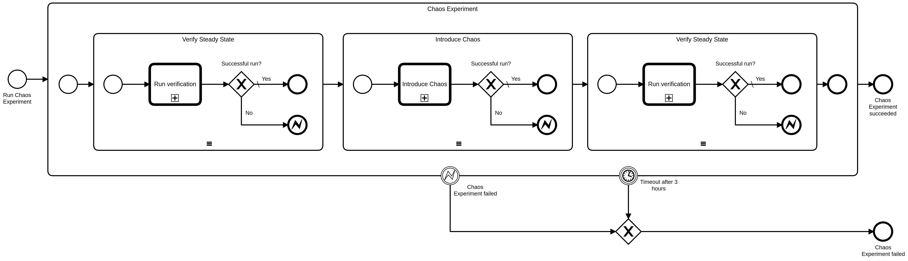

# Zeebe Cluster Testbench

Test bench to run tests against a Zeebe cluster.

Available Documentation

- [Developer handbook](docs/developer-handbook.md)
- [Release Process](docs/release-process.md)
- [Operator handbook](docs/operator-handbook.md)
- [Technical documentation](docs/technical-documentation.md)
- [Service Task Reference](docs/service-tasks.md)
- [Extension Guide](docs/extension-guide.md)

## User Guide

This document describes the different processes that are deployed as part of this project. These processes can be launched directly (for ad hoc test runs); can be launched by Zeebe as part of one of the periodic test protocols (e.g _QA Protocol_); or can be launched from an external tool (e.g. _Jenkins_).

This document also contains a list of the available workers. Users are encouraged to use these workers and define and deploy additional processes based on these building blocks.

### Tests

#### Sequential Test

In the sequential test a sequential process is executed several times in succession. There is at most one active process instance at any given time. In other words, there is no parallelism - neither inside the process being tested nor in the test driver that starts process instances.

A sequential test has the following parameters:

- _steps_ - number of steps within the process
- _iterations_ - number of times the process shall be executed
- _maxTimeForIteration_ - the maximum duration for one iteration
- _maxTimeForCompleteTest_ - the maximum time for the entire test

This test will fail, if any of the following conditions occur:

- there is an exception during test execution
- a single iteration takes longer than _maxTimeForIteration_
- all iterations take longer than _maxTimeForCompleteTest_

In case of backpressure the iteration will be repeated. The time spent making requests that return backpressure responses and repeating those requests is included in the overall execution time, which must be smaller than _maxTimeForCompleteTest_ for the test to pass.

##### Sequential Test Process

This process runs the sequential test in a given cluster in Camunda Cloud:

**Process ID:** `sequential-test`

|         Inputs          |                   Description                   |                Type                |
|-------------------------|-------------------------------------------------|------------------------------------|
| `testParams`            | Settings to parameterize the sequential test    | `SequentialTestParameters`         |
| `authenticationDetails` | Credentials to authenticate against the cluster | `CamundaCloudAutenticationDetails` |

|   Outputs    | Description |     Type     |
|--------------|-------------|--------------|
| `testReport` | test report | `TestReport` |
| `testResult` | test result | `TestResult` |

#### Chaos Toolkit

This test runs a repertoire of [chaos experiments](https://github.com/zeebe-io/zeebe-chaos) against a given cluster. Different experiments run in sequence.

The set of experiemnts to run depends on the cluster plan.

See [inventoriy](https://github.com/zeebe-io/zeebe-chaos/blob/master/inventory.md) for more information on the available tests.

##### Chaos Experiment Process

This process runs the chaos experiment against a given cluster in Camunda Cloud:

**Process ID:** `chaosExperiment`

|         Inputs          |                                      Description                                      |                Type                |
|-------------------------|---------------------------------------------------------------------------------------|------------------------------------|
| `clusterPlan`           | name of the cluster plan for the cluster; used to differentiate the chaos experiments | `String`                           |
| `testParams`            | Settings to parameterize the chaos test                                               | tbd                                |
| `authenticationDetails` | Credentials to authenticate against the cluster                                       | `CamundaCloudAutenticationDetails` |

|   Outputs    | Description |     Type     |
|--------------|-------------|--------------|
| `testReport` | test report | `TestReport` |
| `testResult` | test result | `TestResult` |

### Test Processes

The testbench deploys several processes to orchestrate the test execution. The work flows reference each other - a higher level process will call a lower level process.

#### QA Github Trigger

This process runs all tests in a fresh cluster in Camunda Cloud in different cluster plans:

**Process ID:** `qa-github-trigger`

The QA github trigger runs all tests against a fresh created cluster (based on a temporary generation).

This process is triggered on demand (e.g. for a PR merge or to test a release candidate). It will create a temporary generation for the tests to run. This generation will be removed after all tests and all analysis tasks have completed.

Depending of the region of the new created cluster chaos experiments are executed plus the normal sequential tests.

> [!Note]
>
> The step _Trigger Analyse Cluster Process_ starts a second process which keeps the cluster alive for further analysis. The cluster will be deleted after analysis. This way, the test process can terminate and report the test result, while the analysis is happening asynchronously.

|        Inputs        |                                                                                                     Description                                                                                                      |   Type   |
|----------------------|----------------------------------------------------------------------------------------------------------------------------------------------------------------------------------------------------------------------|----------|
| `zeebeImage`         | The Zeebe image that shall be tested (fully qualified name, including registry and label). _Note_ the label/tag must start with a semantic version, otherwise it will be rejected by the backend                     | `String` |
| `generationTemplate` | Name of an existing generation that will be used as a template for the generation to be created. The template will serve to identify the versions of Operate and Elasticsearch that Zeebe image shall be paired with | `String` |
| `channel`            | name of the channel for the tests                                                                                                                                                                                    | `String` |

### Utility Processes

Utility processes are utilized by the test processes to perform certain technical tasks

#### Prepare Zeebe Cluster in Camunda Cloud

This process creates a Zeebe cluster in Camnuda cloud and waits until the cluster is ready:

**Process ID:** `prepare-zeebe-cluster-in-camunda-cloud`

|      Inputs       |               Description                |   Type   |
|-------------------|------------------------------------------|----------|
| `generationUUID`  | UUID of the generation for the cluster   | `String` |
| `clusterPlanUUID` | UUID of the cluster plan for the cluster | `String` |
| `channelUUID`     | UUID of the channel for the cluster      | `String` |
| `regionUUID`      | UUID of the region for the cluster       | `String` |

| Runtime Variables |                 Description                 |   Type   |
|-------------------|---------------------------------------------|----------|
| `clusterStatus`   | Current status of the newly created cluster | `String` |

|         Outputs         |                   Description                   |                Type                |
|-------------------------|-------------------------------------------------|------------------------------------|
| `clusterId`             | ID of the cluster in which Zeebe is tested      | `String`                           |
| `clusterName`           | Name of the cluster in which Zeebe is tested    | `String`                           |
| `authenticationDetails` | Credentials to authenticate against the cluster | `CamundaCloudAutenticationDetails` |
| `operateURL`            | URL to Operate web interface                    | `String`                           |

#### External Tool integration

This process supports the integration of external tools (in parrticular Jenkins). The external tool can call this process and pass in the process to call and a business key. The business key must be unique and will be used to fetch the result of the process.

The expectation is that the external tool will register a worker for the job type `businessKey`. This way, the external tool can poll for the result of one particular process instance.

Without this mechanism the only option for the external tool to know about the result would be _client.newCreateInstanceCommand().withResult()_ which is not advisable for long-running processes.

**Process ID:** `external-tool-integration`

|           Inputs            |                                Description                                |   Type   |
|-----------------------------|---------------------------------------------------------------------------|----------|
| `processId`                 | ID of the process to call                                                 | `String` |
| `businessKey`               | Business key. This will be used as job type to fetch the result           | `String` |
| _variables for the process_ | additional variables that will be forwarded to the process that is called |          |

#### Analyse Cluster

This process is usually called after a failure occurred.
It notifies an engineer and keeps the cluster alive until analysis has completed.
Analysis can be marked as completed by either completing the task or sending the `Analysis Completed` message.

**Process ID:** `analyse-cluster`

|    Inputs     |                 Description                  |     Type     |
|---------------|----------------------------------------------|--------------|
| `generation`  | name of the generation for the cluster       | `String`     |
| `clusterPlan` | name of the cluster plan for the cluster     | `String`     |
| `clusterId`   | ID of the cluster in which Zeebe is tested   | `String`     |
| `clusterName` | Name of the cluster in which Zeebe is tested | `String`     |
| `operateURL`  | URL to Operate web interface                 | `String`     |
| `testReport`  | test report                                  | `TestReport` |

#### Clean Up Generation

Generations cannot be deleted immediately after a test protocol has completed. Some of the tests might have failed. In this case the clusters are kept alive for further analysis.

This process peridically checks how many clusters are still using a generation. Once that value is zero, the generation will be removed.

**Process ID:** `clean-up-generation`

|      Inputs      |           Description            |   Type   |
|------------------|----------------------------------|----------|
| `generationUUID` | UUID of the generation to delete | `String` |

### Messages

These messages are important to control aspects of the test control flow:

|       Message       |     Message Name      | Correlation Key |                                       Payload                                       |
|---------------------|-----------------------|-----------------|-------------------------------------------------------------------------------------|
| Analyse Cluster     | `Analyse Cluster`     | n/a             | `generation`, `clusterPlan`, `clusterId`, `clusterName`, `operateURL`, `testReport` |
| Analysis Completed  | `Analysis Completed`  | `clusterId`     | n/a                                                                                 |
| Clean up Generation | `Clean Up Generation` | n/a             | `generationUUID`                                                                    |

