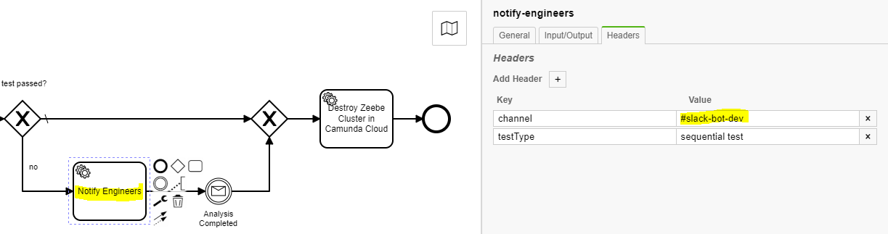

# Operator Handbook

## Update
1. `kubectl delete -f testbench.yaml`
1. `kubectl apply -f testbench.yaml`

## Initial Setup

### Summary

You need:
* Kubernetes cluster
* Zeebe cluster for test orchestration
* Camunda Cloud Organizaton account
* Camunda Cloud API credentials to create test clusters on demand
* Google Sheet file to receive the test results
* Servicce account, credentials and permissions to write to that file
* Slack app and token to send notifications to slack channel
* Slack channel to recieve notifications  

Setup and deployment:
* Look at `testbench.yaml` and `secrets.yaml.template` and fill in the fields
* Setup a Kubernetes cluster to deploy into
* Deploy secrets `kubectl apply -f secrets.yaml`
* Deploy application `kubectl apply -f testbench.yaml`
* Check in logs that self check was successful (happens at start up and connects to all external systems)
* Check in test orchestration cluster that workflows were deployed 

### Detailed Instructions

#### Test Orchestration Cluster

1. Login to Camunda Cloud
1. Create new cluster
1. Create new client for that cluster
1. Fill deployment descriptors as follows:

| File | Field | Content |
| ---- | ----- | ------- | 
| testbench.yaml | ZCTB_AUTHENTICATION_SERVER_URL | Cluster Client -> Connection Information -> ZEEBE_AUTHORIZATION_SERVER_URL |
| testbench.yaml | ZCTB_CLIENT_ID | Cluster Client -> Connection Information -> ZEEBE_CLIENT_ID |
| secrets.yaml | clientSecret | Cluster Client -> Connection Information -> ZEEBE_CLIENT_SECRET |
| secrets.yaml | contactPoint | Cluster Client -> Connection Information -> ZEEBE_ADDRESS |

#### Camunda Cloud API Client

1. Login to Camunda Cloud
1. Go to Organization Settings -> Cloud API
1. Create new client with all privileges
1. Fill deployment descriptors as follows:

| File | Field | Content |
| ---- | ----- | ------- | 
| testbench.yaml | ZCTB_CLOUD_API_URL | Depends on the stage (e.g. `https://console.cloud.ultrawombat.com/customer-api/` for integration stage) |
| testbench.yaml | ZCTB_CLOUD_AUDIENCE | Depends on stage (e.g. `api.cloud.ultrawombat.com` for integration stage)  |
| testbench.yaml | ZCTB_CLOUD_AUTHENTICATION_SERVER_URL | Depends on stage (e.g. `https://login.cloud.ultrawombat.com/oauth/token` for integration stage) |
| testbench.yaml | ZCTB_CLOUD_CLIENT_ID | Cloud API -> Client -> Client Id |
| secrets.yaml | cloudClientSecret | Cloud API -> Client -> Client Secret |

#### Google Sheet and Service Account

1. Enable Google Sheets API https://console.developers.google.com/
1. Create a new service account with no particular roles https://cloud.google.com/iam/docs/creating-managing-service-accounts 
1. Download JSON key file for this service account
1. Create a new sheet
1. Share sheet with service account (via the service account's email); give it edit permissions
1. Fill deployment descriptors as follows:

| File | Field | Content |
| ---- | ----- | ------- | 
| testbench.yaml | ZCTB_REPORT_SHEET_ID | ID of the sheet you created (Press share, copy link; take the bit that looks like an ID) |
| secrets.yaml | sheetsApiKeyfileContent | Complete content of downloaded key file |

#### Slack App and Channel

1. Create a Slack application (https://api.slack.com/start/overview)
1. Download token to authenticate the app
1. Give it permissions to write to channels
1. Invite your app to the channel it should publish to
1. Edit BPMN files that use slack-based service tasks; the channel to publish to is a header field

1. Fill deployment descriptors as follows:

| File | Field | Content |
| ---- | ----- | ------- | 
| secrets.yaml | slackToken | The token for your app |

### Deployment

* Create a Kubernetes cluster and namesapce
* Run `kubectl apply -f secrets.yaml`
* Run `kubectl apply -f testbench.yaml`
* Check the log for a successful self-test:
```
14:11:37.767 [main] INFO  io.zeebe.clustertestbench.bootstrap.BootstrapFromEnvVars - Bootstrapper starting
14:11:39.764 [main] INFO  io.zeebe.clustertestbench.bootstrap.Launcher - Selftest - Successfully established connection to test orchestration cluster
14:11:41.049 [main] INFO  io.zeebe.clustertestbench.bootstrap.Launcher - Selftest - Successfully established connection to cloud API
14:11:41.519 [main] INFO  io.zeebe.clustertestbench.bootstrap.Launcher - Selftest - Successfully established connection to Slack
14:11:42.415 [main] INFO  io.zeebe.clustertestbench.bootstrap.Launcher - Selftest - Successfully established connection to Google Sheets
14:11:42.422 [main] INFO  io.zeebe.clustertestbench.bootstrap.WorkflowDeployer - Found workflows to deploy:[workflows\run-all-tests-in-camunda-cloud-per-cluster-plan.bpmn, workflows\run-all-tests-in-camunda-cloud-per-region.bpmn, workflows\run-all-tests-in-camunda-cloud.bpmn, workflows\run-sequential-test-in-camunda-cloud.bpmn]
14:11:42.422 [main] INFO  io.zeebe.clustertestbench.bootstrap.WorkflowDeployer - Deploying run-all-tests-in-camunda-cloud-per-cluster-plan.bpmn
14:11:42.622 [main] INFO  io.zeebe.clustertestbench.bootstrap.WorkflowDeployer - Deploying run-all-tests-in-camunda-cloud-per-region.bpmn
14:11:42.718 [main] INFO  io.zeebe.clustertestbench.bootstrap.WorkflowDeployer - Deploying run-all-tests-in-camunda-cloud.bpmn
14:11:42.824 [main] INFO  io.zeebe.clustertestbench.bootstrap.WorkflowDeployer - Deploying run-sequential-test-in-camunda-cloud.bpmn
14:11:42.923 [main] INFO  io.zeebe.clustertestbench.bootstrap.Launcher - Registering job worker MapNamesToUUIDsWorker for: map-names-to-uuids-job
14:11:42.934 [main] INFO  io.zeebe.clustertestbench.bootstrap.Launcher - Job worker opened and receiving jobs.
14:11:42.941 [main] INFO  io.zeebe.clustertestbench.bootstrap.Launcher - Registering job worker CreateClusterInCamundaCloudWorker for: create-zeebe-cluster-in-camunda-cloud-job
14:11:42.942 [main] INFO  io.zeebe.clustertestbench.bootstrap.Launcher - Job worker opened and receiving jobs.
14:11:42.942 [main] INFO  io.zeebe.clustertestbench.bootstrap.Launcher - Registering job worker SequentialTestLauncher for: run-sequential-test-job
14:11:42.943 [main] INFO  io.zeebe.clustertestbench.bootstrap.Launcher - Job worker opened and receiving jobs.
14:11:42.948 [main] INFO  io.zeebe.clustertestbench.bootstrap.Launcher - Registering job worker RecordTestResultWorker for: record-test-result-job
14:11:42.948 [main] INFO  io.zeebe.clustertestbench.bootstrap.Launcher - Job worker opened and receiving jobs.
14:11:42.949 [main] INFO  io.zeebe.clustertestbench.bootstrap.Launcher - Registering job worker NotifyEngineersWorker for: notify-engineers-job
14:11:42.950 [main] INFO  io.zeebe.clustertestbench.bootstrap.Launcher - Job worker opened and receiving jobs.
14:11:42.957 [main] INFO  io.zeebe.clustertestbench.bootstrap.Launcher - Registering job worker DeleteClusterInCamundaCloudWorker for: destroy-zeebe-cluster-in-camunda-cloud-job
14:11:42.957 [main] INFO  io.zeebe.clustertestbench.bootstrap.Launcher - Job worker opened and receiving jobs.
```
* Check that workflows have been deployed to test orchestration cluster