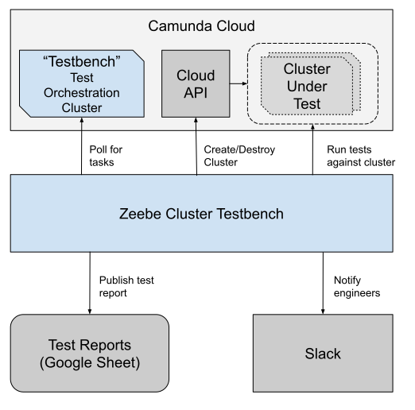
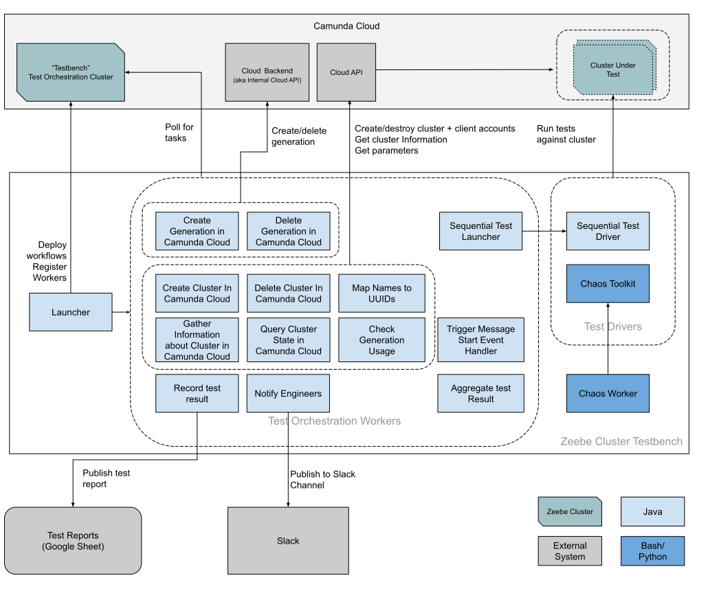

Introduction and Goals
======================
The _Zeebe Cluster Testbench_ is a tool to run end to end tests against Zeebe clusters.

Requirements Overview
---------------------
* It must be possible to run tests periodically
* It must be possible to run tests ad hoc
* It must be possible to run tests against a Zeebe cluster deployed in Camunda Cloud
* Clusters under test shall be created on demand and destroyed when it is no longer needed
* Test results must be published and archived for later data mining
* Engineers shall be notified when a test failure occurred
* The cluster in which a failure occurred must be kept alive until an engineer was able to analyse the failure

Quality Goals
-------------
* The solution shall use hardware resources economically.
* The solution shall be able to scale with increased demand
* The solution shall require low maintenance in production
* The solution shall be fault tolerant to unavailability of external systems
* The solution shall automatically recover in case of failures.
* The solution shall be flexible to adapt to future needs.

Architecture Constraints
========================

| Constraint | Rationale |
| --- | --- |
| Use Zeebe cluster to orchestrate the tests | This is part of the "drink your own champaign" / "eat your own dog food" initiative. Apart from that using Zeebe for orchestration is perfect for the given quality goals |
| Java (or other languages in the Java ecosystem) for implementation | Camunda has many experienced Java software developers |
| Maven / Jenkins build pipeline | Integrates well with existing Camunda infrastructure |
| Kubernetes as runtime environment | Follows current best practices for scalable applications |

System Scope and Context
========================

Solution Strategy
=================

The _Zeebe cluster testbench_ is basically a bunch of workers that request jobs from the _testbench_ test orchestration cluster.

The test orchestration cluster contains different workflows that define the steps for a test. See [README.md](../README.md) for a documentation of the different processes.

Once a test is started, this will e.g. trigger the worker to create a cluster. Afterwards, another worker is triggered to run the test. Finally, other workers are triggered to publish the test results, notify engineers (if needed) and destroy the cluster again.

The workers are stateless. The only state is kept by Zeebe in the _testbench_ test orchestration cluster. Workers exchange information by reading from and writing to variables in the workflow.

Building Block View
===================

Modules
-------
* `core` - contains the launcher and the workers that are orchestrated by the test orchestration cluster
* `cloud-client` - contains a server facade to interact with the Cloud API
* `testdriver-api` - contains interfaces and shared classes to be used by several test drivers
* `testdriver-sequential` - contains the workers for the sequential test

Runtime View
============
Most of the runtime behavior is determined by the workflows deployed to the _testbench_ cluster. See [README.md](../README.md) for a documentation of the different processes.

Startup
-------
1. Read all environment variables
1. Perform self test - the objective of the self test is to check connectivity to external systems; if these fail on startup, the application will not launch.
1. Deploy test orchestration workflows
1. Register workers

Fault Tolerance/Recovery
------------------------
Fault tolerance and recovery are handled by the _testbench_ cluster:
 * Whenever a task fails, it will be retried.
 * If a worker dies, the job will time out and be reactivated.
 * If the application crashes, all workers die. As soon as the application is back up, workers can poll for job again.

 The _testbench_ cluster is deployed to a high availability cluster.

Design Decisions
================
* Keep it simple - all workers are currently part of one deployment. This allows to start/manage all workers with a single deployment. However, it also allows for future scale out when several instances of each worker are needed.
* No framework (yet). Mostly to keep the dependencies to a minimum and not to commit on any architectural pattern too soon. (Given that the current implementation is mostly workers, a reactive, non-blocking IO framework would be ideal. However, it is questionable whether the load will ever get so high that the benefits of those frameworks materialize. CDI has been missed while implementing the current solution. So developer convenience might be a stronger driver for architectural commitment then technical criteria)
* All environment variables that are used by the solution are read out in the bootstrap class. Mostly because it gets opaque when environment variables are sprinkled throughout the code.
* Environment variables are currently the only way to configure the application
* Each worker defines its input and output parameters in dedicated classes. this is a little more verbose than necessary, but it also documents their interface.
* The communication to the _Cloud API_ uses RESTEasy Client API. This was the option with the least dependencies (in comparison to Spring RestTemplate, MicroProfile RestClient, and other )

Risks and Technical Debts
=========================
* Currently, there is no orderly shutdown. So far this has not caused any problems. However, it does slow the tests down when the application crashes or is restarted due to redeploys. The delay is due to Zeebe for the jobs to timeout before rescheduling new jobs.
* All workers share the same thread pool. If this thread pool dies or is blocked, then nothing will move forward.
* The application has no self monitoring. It relies heavily on Zeebe to restart jobs when things go wrong.
* The process to create a cluster has a potential infinite loop. If the cluster is created, but never gets ready, then the process will not terminate.
* The worker `MapNamesToUUIDsWorker` writes to the same variables that it uses as input. Once overwritten, it is no longer possible to look at what the input was. This already confused root cause analysis for a bug.
* The _CloudAPI_ might change and become incompatible. Diagnosing these problems is quite tricky with the RESTEasy Client API. It does a great job at giving developers a nice interface; however if a given REST endpoint returns e.g. a HTML page with a helpful human readable error message it is difficult to get a hold of this error message.
* The _Internal Cloud API_ might change and become incompatible. We are using a Camunda internal API here with no guarantees on backwards compatibility.
* The chaos worker is currently written in bash, which might be harder to maintain then other languages. The `zbctl` worker itself comes with some limitations, which we could overcome with other clients. Related issue [#110](https://github.com/zeebe-io/zeebe-cluster-testbench/issues/110)

Appendix
========

Glossary
--------

| Term | Definition |
| --- | --- |
| Cloud API | API provided by Camunda Cloud to create, query and destroy clusters, and to create, query and delete client accounts for these clusters |
| Internal Cloud API/Cloud Backend | Internal API of Camunda Cloud. It is used to perform administrative actions like creating new generations for clusters to test. |
| _testbench_ cluster | The Zeebe cluster in which the tests are orchestrated |
| test driver | Set of classes to run a test and determine the outcome of the test |
| worker | Class that handles Zeebe jobs. Workers are registered for _service tasks_ of a given job type. |

Arc42 template
--------------

This document takes inspiration from arc42, the Template for documentation of software and system
architecture by Dr. Gernot Starke, Dr. Peter Hruschka and contributors.

Template Revision: 7.0 EN (based on asciidoc), January 2017

© We acknowledge that this document uses material from the arc 42
architecture template, <http://www.arc42.de>. Created by Dr. Peter
Hruschka & Dr. Gernot Starke.
